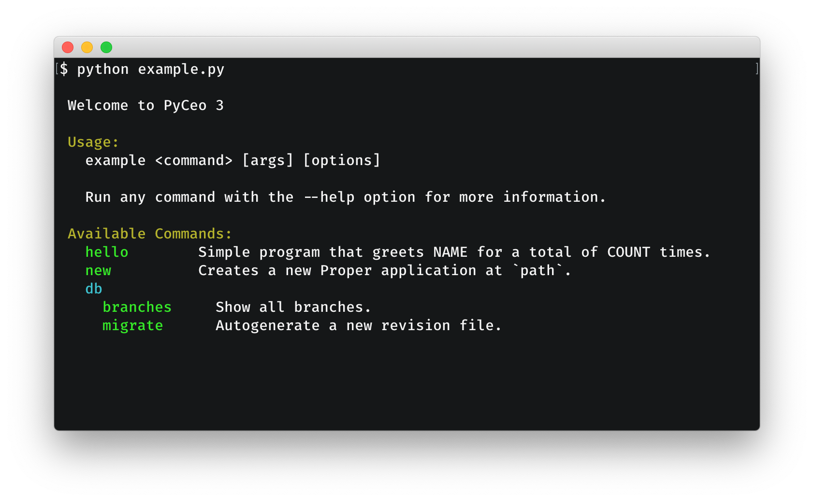

# pyceo

*It looks good and delegate all the real work to you* ;)

A minimal and composable command-line-interface toolkit.

In three points:

- Completely customizable help page, but pretty by default.
- Arbitrary nesting of "managers" (groups) of commands
  Just do `my_manager.manager(another_manager, help="A one-line description")`.


## An example

```python
# example.py
from pyceo import manager, param, option


@manager()
def cli():
    """Welcome to Proper v1.2.3"""
    pass


@cli.command("Creates a new Proper application at `path`")
@param("path", help="Where to create the new application?")
def new(path):
    """The "proper new" command creates a new Proper application with a default
    directory structure and configuration at the path you specify.

    Example: `proper new ~/Code/blog`
    This generates a skeletal Proper application at `~/Code/blog`.
    """
    pass


@cli.manager("Database-related commands")
def db():
    pass


@db.command("Autogenerate a new revision file")
@option(
    "-m", "--message",
    help="Revision message"
)
@option(
    "--sql",
    help="Don't emit SQL to database, dump to standard output instead"
)
@option(
    "--head",
    help="Specify head revision or <branchname>@head to base new revision on"
)
@option(
    "--splice",
    help="Allow a non-head revision as the \"head\" to splice onto"
)
@option(
    "--branch-label",
    help="Specify a branch label to apply to the new revision"
)
@option(
    "--version-path",
    help="Specify specific path from config for version file"
)
@option(
    "--rev-id",
    help="Specify a hardcoded revision id instead of generating one"
)
@option(
    "-n", "--name",
    help="Name of section in .ini file to use for Alembic config"
)
@option(
    "-x",
    help="Additional arguments consumed by custom env.py scripts"
)
def migrate(**kwargs):
    """This is an alias for "revision --autogenerate"."""
    pass


if __name__ == "__main__":
    # cli.run(default="new")
    cli.run()
```

If your run `python example.py` you will see the autogenerated (and completely
customizable) help message:




## How minimal?

**pyceo** doesn't include any related features like prompts, progress bars, table formatting, [file editing](https://pypi.org/project/text-editor/), etc. It doesn't matter because for those features many dedicated python libraries can be used.

You could say it *focuses on its core competences while synergetically interface with other libraries to take it to the next level*.


## Why don't just use optparse or argparse?

Are you kidding? Because this is way easier to use and understand.


## Why don't just use click?

Because this looks better and is easier to use and understand.


## Interested?

~See the documentation for a complete description of the API.~ TODO
